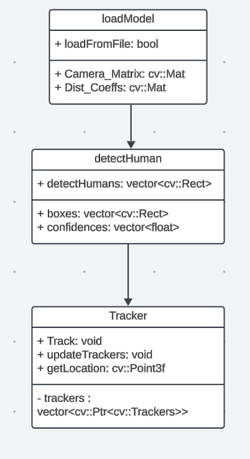

# Monocular-Human-Detection-YOLO
 [](https://codecov.io/gh/robosac333/Monocular-Human-Detection-YOLO) [](LICENSE)

## Step 1: OpenCV Installation
Open a terminal and run the following commands to remove any existing 

### Install Required Dependencies
```sh
sudo apt update
sudo apt install build-essential cmake git libgtk2.0-dev pkg-config \
libavcodec-dev libavformat-dev libswscale-dev libjpeg-dev \
libpng-dev libtiff-dev libjasper-dev libv4l-dev libatlas-base-dev gfortran \
python3-dev
```

### Download OpenCV 4.10.0
```sh
cd ~
git clone https://github.com/opencv/opencv.git
cd opencv
git checkout 4.10.0
```

### OpenCV installations:
```sh
mkdir build
cd build
cmake -D CMAKE_BUILD_TYPE=Release -D CMAKE_INSTALL_PREFIX=/usr/local ..
make -j$(nproc)
sudo make install
```

## Step 2: YoloV11 Model Download and Conversion

- Download the YOLOV3 weights [here](https://drive.google.com/drive/folders/1hTzRYYRm9nEMRbxYX1bqpsGFVuv-hrrX?usp=sharing). 

- We have updated the UML Diagram in the Phase1 to correctly represent functionalities as per the product backlog 

<p align="center">
  
</p


## Step3: Building the Workspace

```bash
# Configure the project and generate a native build system:
  # Must re-run this command whenever any CMakeLists.txt file has been changed.
  cmake -S ./ -B build/
# Compile and build the project:
  # rebuild only files that are modified since the last build
  cmake --build build/
  # or rebuild everything from scracth
  cmake --build build/ --clean-first
  # to see verbose output, do:
  cmake --build build/ --verbose
# Run program:
  ./build/app/shell-app
# Run tests:
  cd build/; ctest; cd -
  # or if you have newer cmake
  ctest --test-dir build/
# Build docs:
  cmake --build build/ --target docs
  # open a web browser to browse the doc
  open docs/html/index.html
# Clean
  cmake --build build/ --target clean
# Clean and start over:
  rm -rf build/
```

- The video for this Phase implementation can be found [here](https://youtu.be/I4-NO7tivLg?si=6dGpwYZuMBzqrTG6)

# Phase0

Phase 0 focuses on the project proposal and provides information about the Agile Iterative Process (AIP) model to be used for software development throughout the project.

The Phase 0 project report, located at Documentation/Phase0_Initial/Project Proposal Group 3.pdf , outlines a comprehensive plan and vision for the project, detailing the implementation strategies. It covers all the elements of a standard software development plan, offering an in-depth analysis.

The quad chart, found at Documentation/Phase0_Initial/QuadChart.pdf, summarizes key aspects of the project, including the product, stakeholders, capabilities, and success criteria. This chart is a crucial component of the AIP methodology, which will guide the project’s progression.

Additionally, a brief video is embedded below, providing an overview of the project, including details from the report and quad chart. To view the video directly, click on the link provided [here](https://www.youtube.com/watch?v=ejj0KuOoPAQ)